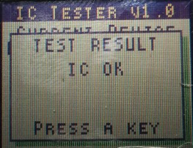

# PicIcTester
IC Tester using PICs

I made this project because I have a lot of 7400-series digital logic integrated circuits acquired from flea market and I wanted to verify them.  
The tester is using a **PIC18F452-I/P** to perform the tests and a **PIC16F628A** to handle the display, keypad and relays.

## Main features

* Search IC by name
* Create, run and store and load custom tests directly on tester
* Run tests created on a connected computer
* IC identification
* Can test logic circuits with pinout count between 2 and 28 pins
* IC in narrow or normal packaging
* Default testing will use relays to activate the IC power pins
* IC identification will use low power, so the tester can't damage the IC
* Keypad operation
* Computer connection
* Single sided PCB, so you can made it at home

## Compiled code
Here are the hex files which contain the compiled code for [PIC18F452-I/P aka Tester](binaries/Tester.production.hex) and [PIC16F628A aka Interface](binaries/Interface.production.hex).

## Database
The tester uses a modified database which I found on [Smart-IC-Tester](https://github.com/akshaybaweja/Smart-IC-Tester).  
In order to speed up the search on database I created an index at the start of it. I shrinked it by using the Unix line endings and by merging identical tests. Also some teste were fixed or updated.  
The program which handle the database indexing is in [DbCreate](DbCreate) folder.  
The ready for use database file is [here](Database/database.txt.bin)

## Database storage
To store the database I used an **24LC256** (256Kb I2C compatible 2-wire Serial EEPROM) but you can use an eeprom up to 64KiB in size.

## Display
I'm using a **Nokia 3510i LCD** with a modified code from [Interfacing Nokia 3510i and 5110 LCD with PIC Microcontroller](http://www.toughdev.com/content/2011/03/interfacing-nokia-3510i-and-5110-lcd-with-pic-microcontroller/)

## Font
I'm using a modified and stripped down version of **TINYTYPE** from [8x8 Pixel ROM Font Editor](https://www.min.at/prinz/o/software/pixelfont/)

## Hardware
All the files which you need in order to create the PCBs are in the [hardware](hardware) folder.

## Case
The files for 3D printing a case are available in [FreeCAD](FreeCAD) folder

## Menu &amp; navigation

Navigate in main menu using *UP* and *DOWN* keys, pressing the *OK* key will activate the selected option  

* Search &amp; Test
    * Enter Search IC screen using the *OK* key
        * When in search box you can enter the device name using the keypad (keys *0* through *9*)
        * To select a device use the *DONW* key
            * At this step you can cancel and return to main screen using the *LEFT* key
            * Enter the test screen using the *OK* key
                * Navigate between buttons using *UP* and *DOWN* keys
                * Start testing by selecting *START* button and then press *OK* key
                    * Test result is displayed
                        * Pressing any key will close this screen and return to test screen
                * Return to main menu using *CLOSE* button
* PC Test
    * Enter PC Test screen using the *OK* key
        * To cancel the PC test press any key
        * After receiving the test data from PC, the tester will enter the PC test screen
            * Here you have 3 options: *START*, *SAVE*, *CLOSE*
            * Choosing *START* will run the test received from PC
            * You can save the test in *PIC18F452* EEPROM for later use using the *SAVE* button
            * Return to main menu using *CLOSE* button
* Custom Test
    * Enter Custom test screen using the *OK* key
        * If a previous test was saved, here you have the option to load it back from eeprom
            * Choosing *NO* will proceed to create a new custom test
            * Choosing *YES* will load the test from eeprom and will advance to test screen
        * If no previous test exist or you choose to ignore the existing custom test, it will display the Custom test name screen
            * Enter a test name using the keys *0* through *9*
            * You can remove the last character entered using the *LEFT* key
            * When ready, use the *DOWN* key to select the *OK* button and using the *OK* key advance to Test Pins screen
                * Here you can specify the number of pins for the subject IC, only even numbers and up to 28 pins
                * You can remove the last char using *LEFT* key
                * When ready, use the *DOWN* key to select the *OK* button and using the *OK* key advance to Test cases screen
                    * Here you can specify one test case at a time
                    * You can enter the test case using the keys from *0* through *7*
                        * 0 key -> displays 0 -> INPUT PIN LOW
                        * 1 key -> displays 1 -> INPUT PIN HIGH
                        * 2 key -> displays L -> OUTPUT PIN LOW
                        * 3 key -> displays H -> OUTPUT PIN HIGH
                        * 4 key -> displays G -> PIN as POWER GROUND
                        * 5 key -> displays V -> PIN as POWER VCC
                        * 6 key -> displays X -> DON'T USE the PIN
                        * 7 key -> displays C -> USE the PIN as CLOCK
                    * You can remove the last char using *LEFT* key
                    * You need to enter the same number of chars as the previously specified IC pins. If you have more chars than the number of pins, the tester will ignore excess data.
                    * When ready, use the *DOWN* key to select the *NEXT* button to confirm the current test case
                    * After entering and confirming at least one test case you can use the *DONE* button to advance to Start Test screen
                        * Here you have the same options as on PC Test screen
* Identify IC
    * Enter Identify IC screen using the *OK* key
        * Here you need to specify the number of pins which IC has, using keys *0* through *9*
        * You can remove the last char using *LEFT* key
        * You can return to main menu using *DOWN* key, selecting the *CLOSE* button and using the *OK* key
        * When ready use the *DOWN* key, select *START* button and pressing the *OK* key to start the identifying process
            * The identification process is not using the relays, so in some cases the IC will be not found because, probably, it require more power than the 20mA available from PIC I/O ports
            * Also, if the IC is defective, the identification process will fail
            * When identification process is finished, the result found or not found is displayed. 
                * From this screen, pressing any key will return to main menu
* About
    * Enter About screen using the *OK* key
        * Information about tester will be displayed
        * Pressing any key will return to main menu

## PC communication protocol
The PC can be connected to the tester using an commonly available **USB to UART converter** with a baud rate of 115200/8-N-1 and using unix line endings
The tester will not respond if the line sent was processed correctly, but will send back errors if the data was not ok.
The following protocol is used in order to transmit a test case, one line at a time

```
BEGIN
NAME The Test Name (up to 14 chars)
PINS Number of pins (up to 28 pins and even number)
CASE The test case data (following chars are allowed: 0,1,L,H,G,V,X,C and has to match the number of IC pins)
... more test cases... up to 48 test cases
END

```
You can abort the test transmision using `ABORT`  
After receiving the `END` keyword the tester will respond `Test data complete` and will be ready to run the test

## Limitations in current implementation
* Only one test case can be saved in tester eeprom memory
* Only 240 bytes of eeprom data is available for storage of a test case
* The database can be up to 64KiB in size
* The communication between PIC18F452-I/P and PIC16F628A is visible on UART
* You can have only 32767 tests in database
* You can have only 48 test cases in each test
* Maximum message length on UART is 79 characters
* 7 relays are used to implement common power configuration for ICs


## Assembled tester
 

## Menu images
         


